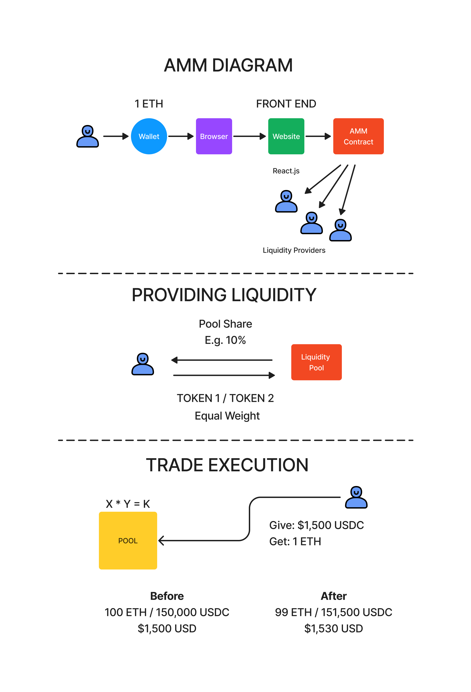

# AMM Exchange

This project demonstrates a basic automated market maker based decentralized exchange.

AMM utilizes a pricing formula of `X * Y = K`. For more information, refer to the [Uniswap Documentation](https://docs.uniswap.org/contracts/v2/concepts/protocol-overview/how-uniswap-works).

## Stack
Technologies Used:
* JavaScript
* React
* Redux
* Solidity

Libraries Used:
* [Ethers.js](https://docs.ethers.org/v5/)
* [ApexCharts.js](https://apexcharts.com/)
* [Lodash](https://lodash.com/)
* [React-Blockies](https://github.com/ethereum/blockies)
* [Reselect](https://github.com/reduxjs/reselect)
* [Redux Thunk](https://github.com/reduxjs/redux-thunk)
* [React-Redux](https://react-redux.js.org/)
* [Redux DevTools Extension](https://github.com/zalmoxisus/redux-devtools-extension)

Testing Libraries:
* [React Testing Library](https://testing-library.com/docs/react-testing-library/intro/)
* [Jest](https://jestjs.io/)
* [Chai](https://www.chaijs.com/)

Dev Tools:
* [Hardhat](https://hardhat.org/)

## Local Testing
To test the DEX locally, run the following:
```shell
npx hardhat node

npx hardhat --network localhost scripts/1_deploy.js

npx hardhat --network localhost scripts/2_seed_exchange.js

npm run start
```


